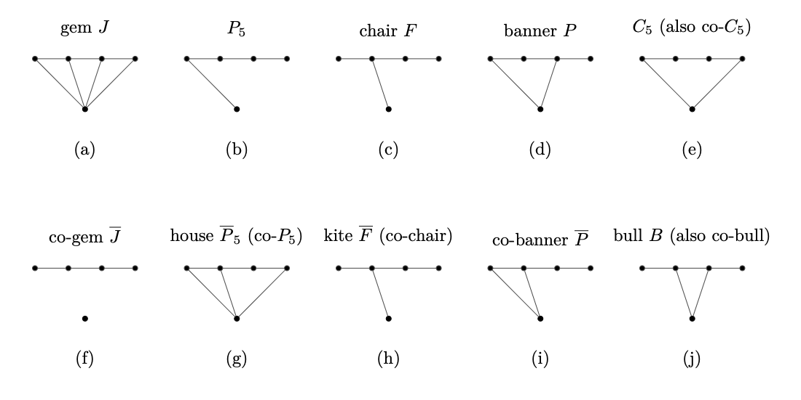

In the **Balanced Vertex Separator** ($\mathrm{BVS}$) problem we are given a graph $G$ and an integer $k$, and we must decide whether there is a set $S \subseteq V(G)$ of at most $k$ vertices such that every connected component of $G - S$ has at most $|V(G)|/2$ vertices.

We will dissect a parameterized reduction from $\mathrm{Clique}$ that establishes:

> $\mathrm{BVS}$ is W[1]-hard parameterized by $k$.

**Construction.** Given a $\mathrm{Clique}$ instance $(G, k)$ with $n = |V(G)|$ and $m = |E(G)|$, assume $n \geqslant 4k^2$ (achievable by adding isolated vertices). Set 

$$\ell := n + m - 2\!\left(k + \binom{k}{2}\right) \;\;\geqslant\;\; 0.$$
Construct a graph $G'$ as follows.
1. The original vertex set $V(G)$ is included in $G'$ and made into a *clique*.
2. For every edge $e = uv \in E(G)$, introduce a new vertex $w_e$ adjacent only to $u$ and $v$ in $G'$.
3. Add a clique $K$ on $\ell$ fresh vertices as a separate component.

Output the $\mathrm{BVS}$ instance $(G', k)$.

## Part A (1)

For each of the ten $5$-vertex graphs shown below — gem $J$, $P_5$, chair $F$, banner $P$, $C_5$, co-gem $\overline{J}$, house $\overline{P}_5$, kite $\overline{F}$, co-banner $\overline{P}$, and bull $B$ — find the smallest $k$ such that the graph admits a balanced vertex separator of size $k$.

Since every graph here has $5$ vertices, $|V(G)|/2 = 2.5$, so every component of $G - S$ must have size at most $2$.

Pick the option that lists the correct $k$ values in order $\bigl(J,\, P_5,\, F,\, P,\, C_5,\, \overline{J},\, \overline{P}_5,\, \overline{F},\, \overline{P},\, B\bigr)$.

## Options
- [x] $(2,\, 1,\, 1,\, 2,\, 2,\, 1,\, 2,\, 2,\, 1,\, 2)$ >>> All ten verified — see the case-by-case explanation in the solution.
- [ ] $(1,\, 1,\, 1,\, 2,\, 2,\, 1,\, 2,\, 2,\, 1,\, 2)$ >>> Off on the gem: removing the apex leaves a $P_4$ on top, which is one component of size $4 > 2$. Every single-vertex deletion in the gem leaves a connected $4$-vertex piece, so $k_J = 2$.
- [ ] $(2,\, 2,\, 1,\, 2,\, 2,\, 1,\, 2,\, 2,\, 1,\, 2)$ >>> Off on $P_5$: deleting the middle vertex of the path splits it into two $P_2$'s, both of size $2$. Hence $k_{P_5} = 1$.
- [ ] $(2,\, 1,\, 1,\, 1,\, 2,\, 1,\, 2,\, 2,\, 1,\, 2)$ >>> Off on the banner: every single-vertex removal of $C_4 + $ pendant leaves a component of size at least $3$, so $k_P = 2$.
- [ ] $(2,\, 1,\, 1,\, 2,\, 2,\, 1,\, 2,\, 2,\, 2,\, 2)$ >>> Off on the co-banner: it has a degree-$3$ "apex" whose removal leaves the disjoint union of two $P_2$'s plus a singleton — components of size $\leqslant 2$. So $k_{\overline{P}} = 1$.

> [!solution]
> Throughout, $|V(G)|/2 = 2.5$, so components must have at most $2$ vertices.
>
> **(a) gem $J$ — $k = 2$.** The gem is $P_4$ (top) plus a universal "apex" vertex adjacent to all four. Every single-vertex deletion leaves a connected graph on $4$ vertices: removing the apex leaves $P_4$; removing any path-vertex leaves the remaining three path-vertices still attached via the apex. So $k > 1$. Removing the apex *and* the second path-vertex breaks the graph into a singleton and a $P_2$.
>
> **(b) $P_5$ — $k = 1$.** Delete the middle vertex; the path falls apart into two $P_2$'s.
>
> **(c) chair $F$ — $k = 1$.** Removing the unique degree-$3$ vertex leaves three pieces of sizes $1,\, 2,\, 1$.
>
> **(d) banner $P$ ($C_4$ + pendant) — $k = 2$.** Removing the pendant leaves $C_4$, removing a $C_4$-vertex leaves $P_3$ (or $P_4$ if the pendant's neighbour is kept), and removing the pendant's neighbour leaves $P_3$ + isolated. All single deletions leave a piece of size $\geqslant 3$. Two deletions of opposite $C_4$-vertices work.
>
> **(e) $C_5$ — $k = 2$.** A single deletion gives $P_4$ (size $4$); two non-adjacent deletions split it into a singleton and a $P_2$.
>
> **(f) co-gem $\overline{J}$ — $k = 1$.** This is $P_4$ together with an isolated vertex. Delete the second (or third) vertex of the $P_4$; the remaining components have sizes $1, 2, 1$.
>
> **(g) house $\overline{P}_5$ ($C_5$ + chord) — $k = 2$.** Same lower bound as $C_5$ via single-deletion case analysis; deleting the two endpoints of the chord splits the rest into two $P_2$'s plus a singleton (after suitable choice).
>
> **(h) kite $\overline{F}$ (diamond + pendant) — $k = 2$.** Single deletions all leave a connected $4$-vertex piece (the diamond minus a vertex is still connected on $3$ vertices, and the pendant is dragged along). Removing the two degree-$3$ vertices of the diamond that are non-adjacent across the missing edge leaves singletons and a $P_2$.
>
> **(i) co-banner $\overline{P}$ — $k = 1$.** Co-banner has a single degree-$3$ vertex (call it $v$); removing it leaves the two non-edges of the original $C_4$ as edges (giving two disjoint $P_2$'s), plus the original pendant as an isolated vertex. Components of size $1, 2, 2$.
>
> **(j) bull $B$ — $k = 2$.** The bull is a triangle with two pendants on distinct triangle-vertices. Removing the apex of the triangle (the one with no pendant) leaves a path of length $3$ (size $4$); removing a pendant leaves the triangle plus the other pendant ($P_3$ glued to a pendant, size $4$); removing a triangle-vertex with a pendant leaves the singleton pendant plus a $P_3$ (size $3$). So $k > 1$. Removing both pendants' neighbours breaks the bull into three singletons.

## Part B (1)

What is the smallest balanced vertex separator of $K_8$ (the complete graph on $8$ vertices)?

## Answer
4

> [!solution]
> Removing any set $S$ from $K_n$ leaves $K_{n-|S|}$, which is a single component of size $n - |S|$. We need $n - |S| \leqslant n/2$, i.e., $|S| \geqslant \lceil n/2 \rceil$. For $n = 8$ this is $4$.

## Part C (1)

Take a worked instance with $n = 10$, $m = 20$, and $k = 4$ (so we are looking for a $4$-clique in $G$). Plugging into the construction gives $\ell = n + m - 2(k + \binom{k}{2}) = 10$, hence $|V(G')| = n + m + \ell = 40$ and $|V(G')|/2 = 20$. Suppose $S \subseteq V(G)$ is a $4$-clique of $G$, and we use $S$ itself as a candidate balanced separator of $G'$. Mark **all** components of $G' - S$ that arise.

## Options
- [x] $\binom{4}{2} = 6$ isolated vertices, namely the $w_e$'s for the edges $e$ inside the clique $S$. >>> Each such $w_e$ has both neighbors in $S$ and is therefore disconnected.
- [x] One component on the $\ell = 10$ vertices of the auxiliary clique $K$. >>> $K$ was disjoint from $V(G) \cup \{w_e\}_e$ from the start; it is untouched by the removal.
- [x] One "main" component on the remaining $|V(G')| - |S| - 6 - 10 = 20$ vertices. >>> $V(G) \setminus S$ together with all $w_e$ that have at least one endpoint outside $S$ form one connected piece — both because $V(G)$ is a clique in $G'$ (minus $S$) and because the $w_e$'s attach to it.
- [ ] $V(G) \setminus S$ becomes a set of isolated vertices. >>> Recall step (i) of the construction: $V(G)$ was made into a clique in $G'$, so $V(G) \setminus S$ stays connected.

> [!solution]
> Component sizes are $1$ (six times), $10$, and $20$. The largest is $20 = |V(G')|/2$, so $S$ is a balanced separator of size $k = 4$.

## Part D (1)

A student proposes the following alternative reduction. Instead of reducing from $\mathrm{Clique}$, they reduce from $\mathrm{Vertex\ Cover}$. The construction is identical to the one in the chapter, except that the auxiliary clique $K$ has $n - k$ vertices (rather than $\ell$):

1. The vertex set $V(G)$ is included in $G'$ and made into a clique.
2. For every edge $e = uv \in E(G)$, introduce $w_e$ adjacent only to $u$ and $v$.
3. Add a clique $K$ on $n - k$ fresh vertices as a separate component.

The output is the $\mathrm{BVS}$ instance $(G', k)$. The student then argues:

- **Forward.** Take a vertex cover $S$ of $G$ with $|S| = k$ and use it as the separator. Every edge $e$ of $G$ has at least one endpoint in $S$, so the edge-vertices $w_e$ are separated from the surviving clique on $V(G) \setminus S$. What remains: $m$ isolated edge-vertices, the surviving clique of size $n - k$, and the auxiliary clique of size $n - k$.
- **Reverse.** A swap argument analogous to the original reduction shows we may assume $S \subseteq V(G)$. Since the target is to make every component of $G' - S$ have size at most $n - k$, this forces every edge to be hit by $S$. So $S$ is a vertex cover.

Both directions seem to go through, and the student concludes: $\mathrm{BVS}$ is W[1]-hard. 

What, if anything, is wrong with this reduction?

## Options
- [x] $\mathrm{Vertex\ Cover}$ parameterized by $k$ is not W[1]-hard. A parameterized reduction *from* a problem that is itself FPT cannot prove W[1]-hardness of the target. >>> Exactly the issue. Even granting the reduction, $\mathrm{VC} \leqslant_{\mathrm{FPT}} \mathrm{BVS}$ is consistent with $\mathrm{BVS}$ being FPT.
- [x] The forward direction does not work, because not every edge gets separated. >>> A real technical wrinkle (only edges with *both* endpoints in $S$ leave their $w_e$ truly isolated) — but even if the forward direction were patched up, the deduction would still be wrong for a deeper reason.
- [x] The argument for the reverse direction does not work at least as stated, because the $n - k$ threshold is not the right balanced-separator threshold. >>> A real technical wrinkle (the actual threshold is $|V(G')|/2 = (2n + m - k)/2$, not $n - k$) — but again, even a corrected threshold would not rescue the deduction.
- [ ] The forward direction works but the reverse direction does not. 
- [ ] The reverse direction works but the forward direction does not. 

> [!solution]
> Parameterized reductions have a *direction*: to prove that target problem $B$ is W[1]-hard, one must reduce *from* a problem $A$ that is already known to be W[1]-hard. $\mathrm{Vertex\ Cover}$ is firmly in FPT (Theorem 2.21 even gives a $2k$-vertex kernel via LP rounding), so $\mathrm{VC}$ is not W[1]-hard.
>
> Even if the proposed reduction from $\mathrm{Vertex\ Cover}$ to $\mathrm{BVS}$ were technically correct in every detail, it would only show that $\mathrm{VC}$ is at least as easy as $\mathrm{BVS}$ — perfectly consistent with $\mathrm{BVS}$ being FPT. Whether $\mathrm{BVS}$ is hard or not simply cannot be settled by reducing *from* an FPT problem.
>
> The original Theorem 13.29 reduces *from* $\mathrm{Clique}$ — a known W[1]-hard problem — which is the only thing that makes the whole argument carry hardness across.

> [!hint]
> Whenever you read "we reduce $A$ to $B$, therefore $B$ is hard", the very first sanity check is: *what is the complexity status of $A$?* If $A$ is in FPT, the conclusion does not follow.

## Part E (1)

A different student tries the same trick from a different W[1]-hard source: $\mathrm{Induced\ Matching}$ on $k$ vertices (assume $k$ is even). An instance is a graph $G$ with integer $k$, and we ask for $S \subseteq V(G)$ of size $k$ such that $G[S]$ is a perfect matching on $S$ — i.e., $S$ is the vertex set of $k/2$ pairwise non-adjacent edges of $G$, with no further edges among them. Assume that this problem is hard parameterized by $k$.

The student mimics the reduction from he clique *exactly* — $V(G)$ becomes a clique in $G'$, every edge $e$ of $G$ contributes a vertex $w_e$ adjacent only to its endpoints, and an auxiliary clique $K$ of size $\ell'$ is added as a separate component. Since the snipped matching contributes $k/2$ edges (as opposed to $\binom{k}{2}$ in the clique case), they pick

$$\ell' \;:=\; n + m - 3k$$
(non-negative for $n$ large enough — pad with isolated vertices). 

The student concludes: $\mathrm{BVS}$ is W[1]-hard. Which of the following is true?

## Options

- [ ] $\mathrm{Induced\ Matching}$ on $k$ vertices is not actually W[1]-hard. >>> It is — this is a standard result.
- [x] In this reduction, $|V(G')|/2 = n + m - \tfrac{3k}{2}$, so the forward direction goes through: deleting an induced matching $S$ on $k$ vertices leaves $k/2$ isolated $w_e$'s, the auxiliary clique of size $\ell'$, and a main component of size exactly $|V(G')|/2$.
- [ ] The forward direction breaks because of how $\ell'$ was chosen. >>> The choice $\ell' = n + m - 3k$ makes the forward direction tight: $|V(G')|/2 = n + m - 3k/2$ exactly matches the size of the main component after deleting an induced matching.
- [x] The reverse direction fails. The balanced-separator constraint forces $G[S]$ to contain at least $k/2$ edges, but this is far weaker than $S$ being an induced matching: any $k$-vertex set inducing $\geqslant k/2$ edges qualifies — including a $k$-clique with $\binom{k}{2} \gg k/2$ edges, which is the *opposite* of an induced matching. >>> Exactly. The constraint counts edges but doesn't see structure, so a balanced separator need not correspond to an induced matching.
- [ ] $\ell' < 0$ for small $n$, so the construction is invalid. >>> The same caveat applies in Theorem 13.29 (where $n \geqslant 4k^2$ is assumed); pad $G$ with isolated vertices so $n \geqslant 3k$. This is not the central issue.

> [!solution]
> Suppose $S \subseteq V(G)$ is a balanced separator of $G'$ of size $k$ (the swap argument from Theorem 13.29 still pushes $S$ into $V(G)$). Letting $p$ denote the number of edges of $G[S]$, the main component of $G' - S$ has size $(n - k) + (m - p)$. The BVS constraint
> $$(n - k) + (m - p) \;\leqslant\; |V(G')|/2 \;=\; n + m - \tfrac{3k}{2}$$
> rearranges to $p \geqslant k/2$.
>
> Now compare with the original $\mathrm{Clique}$ reduction. The analogous inequality there was $p \geqslant \binom{k}{2}$, *and* every $k$-vertex set satisfies $p \leqslant \binom{k}{2}$ — these two squeeze $p = \binom{k}{2}$ exactly, forcing $S$ to be a $k$-clique. Here, the lower bound $p \geqslant k/2$ comes with no matching upper bound: a $k$-clique with $\binom{k}{2}$ edges, a near-clique with $\binom{k}{2} - 1$ edges, or any $k$-set inducing more than $k/2$ edges all satisfy the constraint. The reduction simply does not recover the structural property "induced matching" from "balanced separator".
>
> The forward direction's success and the source problem's W[1]-hardness are both real — and both insufficient on their own. A parameterized reduction is a *contract* in both directions: yes-instances of the source must correspond to yes-instances of the target *and vice versa*. The proposed reduction breaks the second half of that contract.
>
> **Moral.** A hardness proof needs all three of: (i) source is W[1]-hard, (ii) forward direction works, (iii) reverse direction works. Part D showed how (i) can fail; this part shows how (iii) can fail. Skipping any of them sinks the deduction.

> [!hint]
> Try expressing "$S$ is an induced matching" as a constraint on $p$ alone. You'll find you can't — the inequalities $p = k/2$ *and* "the $k/2$ edges in $G[S]$ are pairwise non-adjacent" cannot both be packed into the single global edge-count constraint that the BVS condition produces.
