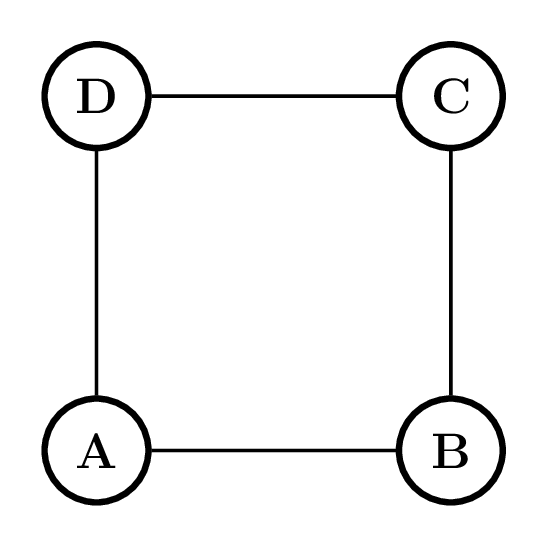
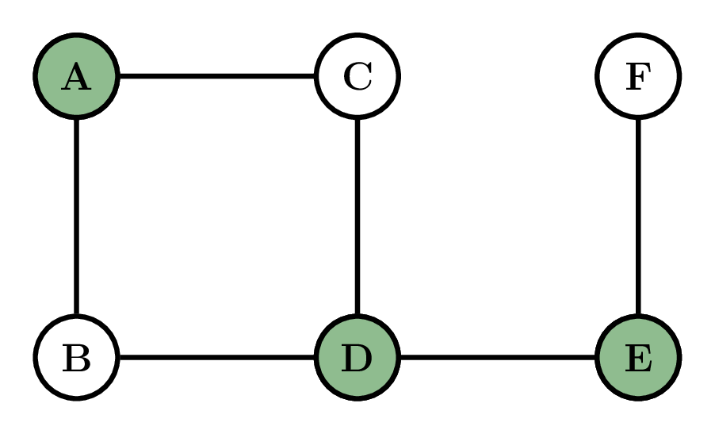

In the eternal vertex cover problem, policewomen occupy vertices of a graph (CandyLand). When an edge is attacked, at least one endpoint must currently have a policewoman and one endpoint policewoman must traverse the attacked edge. Other policewomen may move to neighboring vertices (at most one step). Lata succeeds if she can defend forever against any attack sequence.

## Part A

Suppose Lata figures out a way of placing policemen so that no matter where the Demon attacks, Lata can move the policewomen to protect the city. In other words, Lata has managed to find a configuration that keeps the city safe against one attack. Consider the vertices occupied by policewomen. This subset of vertices forms a:

## Options
- [x] Vertex Cover
- [ ] Independent Set
- [ ] Matching
- [ ] Clique

> [!solution]
> This is a vertex cover because if not, then there is an  uncovered edge, which is susceptible to an attack

## Part B

Suppose the graph of Candyland is a path on seven vertices $v_1, \ldots, v_7$ and Lata places three policewomen on the vertices $v_2, v_4, v_6$. What is the minimum number of attacks the Demon needs to destroy Candyland?
## Options
- [ ] 1
- [x] 2
- [ ] 3
- [ ] 4

## Part C

Suppose the city of CandyLand has 6 houses which are connected by roads as shown in the image below and Lata has placed the policewomen placed at houses A, D and F (as shown in the image), what is the smallest number of attacks in which the Demon is able to destroy the city?

## Options
- [ ] 1
- [ ] 2
- [x] 3
- [ ] 4

## Part D

Suppose Lata finds a maximal matching $M$ the Candyland graph and places a policewoman on each of the houses corresponding to both endpoints of the edges $M$. Can she defend attacks from the Demon forever if she does this?

## Options
- [ ] Yes
- [x] No

## Part E

Suppose Lata finds a maximum matching $M$ the Candyland graph and places a policewoman on each of the houses corresponding to both endpoints of the edges $M$. Can she defend attacks from the Demon forever if she does this?

## Options
- [x] Yes
- [ ] No

## Part F (2)

Suppose we are interested in the smallest number of policewomen that Lata needs to deploy to keep Candyland safe forever. Then:

## Options
- [ ] Having policewomen positioned at both endpoints of a maximal matching is a valid solution and a $2$-approximation.
- [ ] Having policewomen positioned at both endpoints of a maximal matching is a valid solution, but this is not a $2$-approximation.
- [x] Having policewomen positioned at both endpoints of a maximum matching is a valid solution and a $2$-approximation.
- [ ] Having policewomen positioned at both endpoints of a maximum matching is a valid solution, but this is not a $2$-approximation.

