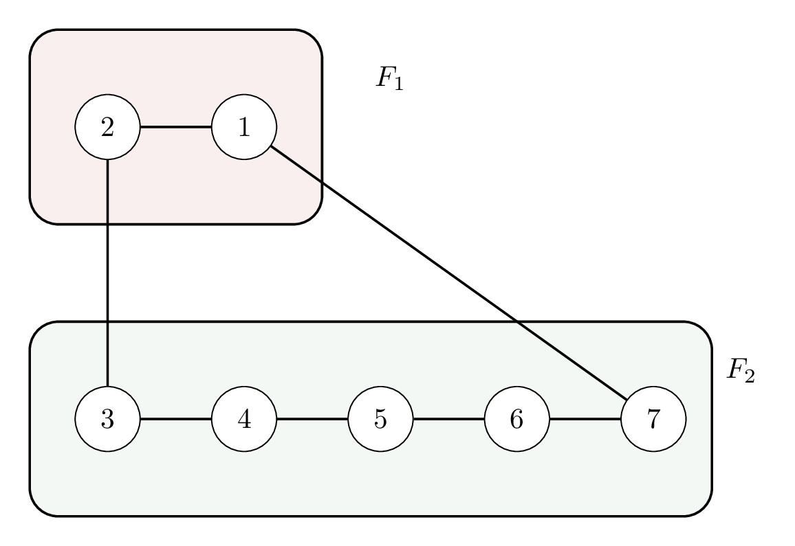

In **Feedback Vertex Set**, we ask whether deleting at most $k$ vertices makes the graph acyclic. These questions focus on iterative compression and the disjoint forest subproblem, especially the degree-two reduction rule.

## Part A

How many times will the degree two rule be invoked, resulting in the removal of a vertex from the graph without including it in the solution?

## Options
- [ ] 1
- [ ] 2
- [ ] 3
- [x] 4
- [ ] 5

## Part B

How many times will the degree two rule be invoked, resulting in the inclusion of the vertex involved in the solution?

## Options
- [x] 1
- [ ] 2
- [ ] 3
- [ ] 4
- [ ] 5

## Part C

Assuming we process lower-indexed leaves first, which vertex is included in the final solution output by the algorithm?

## Options
- [ ] 3
- [ ] 4
- [ ] 5
- [ ] 6
- [x] 7

## Part D

Does the algorithm encounter any branching in its run on this instance?

## Options
- [ ] Yes
- [x] No
- [ ] Depends on the sequence in which leaves are processed

> [!solution]
> **Part A:** 4
> **Part B:** 1
> **Part C:** 7
> **Part D:** No
