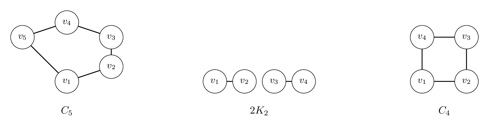

A graph is a **split graph** if its vertices can be partitioned into a clique $C$ and an independent set $I$. In Split Vertex Deletion, we ask whether deleting at most $k$ vertices can turn a given graph into a split graph. Recall the forbidden induced subgraph characterization: $C_5$, $2K_2$, and $C_4$.

## Part A

What is the running time of the exhaustive search algorithm for Split Vertex Deletion?

## Options
- [ ] $O(2^k \cdot \text{poly}(n))$
- [ ] $O(3^k \cdot \text{poly}(n))$
- [ ] $O(4^k \cdot \text{poly}(n))$
- [x] $O(5^k \cdot \text{poly}(n))$

## Part B

How many split partitions can a split graph on $n$ vertices have? Answer with the tightest bound that you can come up with.

## Options
- [ ] At most $n^2$ partitions
- [x] At most $O(n)$ partitions
- [ ] At most $2^n$ partitions
- [ ] At most $n!$ partitions

## Part C

What is the running time of the iterative compression algorithm for Split Vertex Deletion?

## Options
- [x] $O(2^k \cdot \text{poly}(n))$
- [ ] $O(3^k \cdot \text{poly}(n))$
- [ ] $O(4^k \cdot \text{poly}(n))$
- [ ] $O(5^k \cdot \text{poly}(n))$

> [!solution]
> **Part A:** $O(5^k \cdot \text{poly}(n))$
> **Part B:** At most $O(n)$ partitions
> **Part C:** $O(2^k \cdot \text{poly}(n))$
