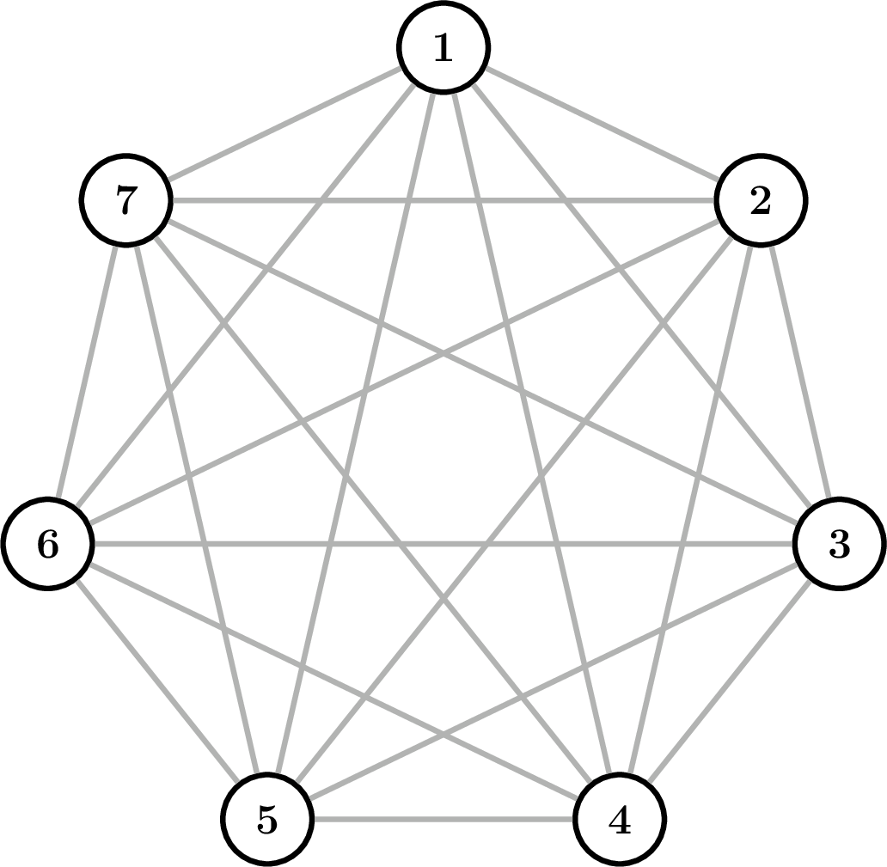
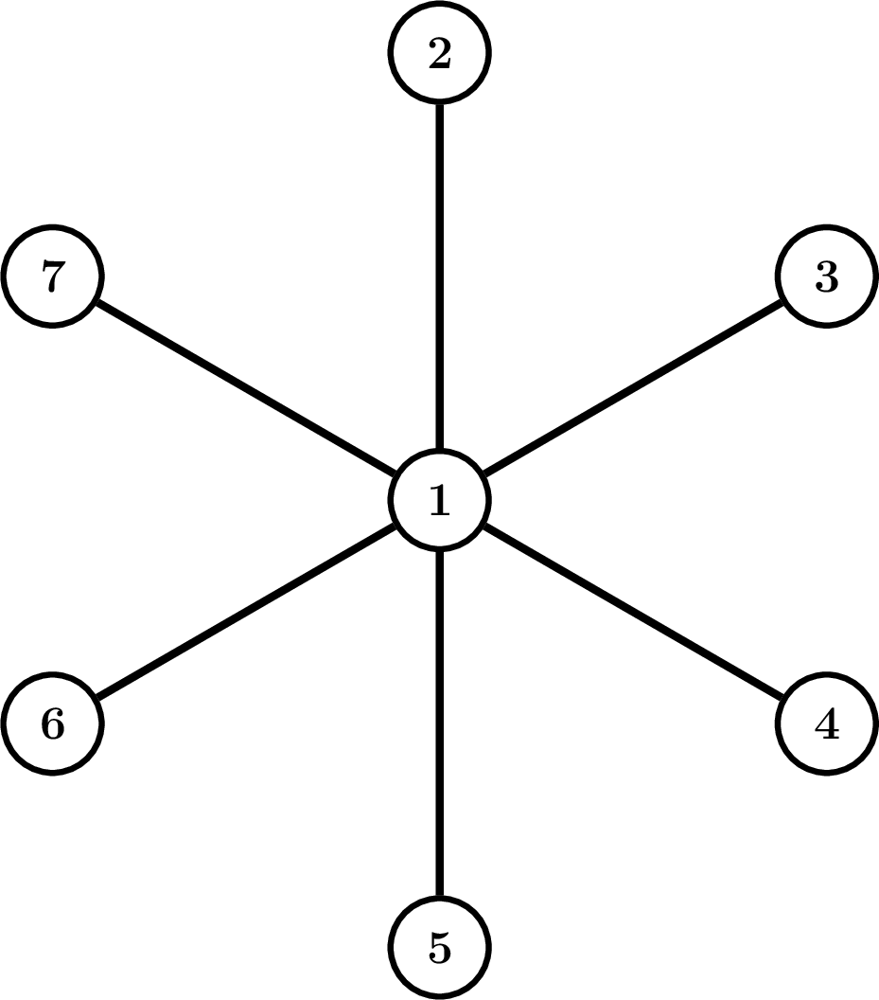

Consider the (unweighted) vertex cover LP relaxation:

$$
\begin{aligned}
\text{Minimize} \quad & \sum_{i=1}^{n} x_i \\
\text{subject to} \quad & x_i + x_j \ge 1 \quad \forall (v_i,v_j) \in E \\
& 0 \le x_i \le 1 \quad \forall i
\end{aligned}
$$

Compare LP-opt and ILP-opt for the three 7-vertex graph families shown below.

## Part A

Consider a path graph on 7 vertices. What are the values of LP-opt and ILP opt for this graph?

## Options
- [ ] LP-opt = 2.5, ILP opt = 3
- [x] LP-opt = 3, ILP opt = 3
- [ ] LP-opt = 3.5, ILP opt = 4
- [ ] LP-opt = 4, ILP opt = 4

## Part B

Consider a complete graph on 7 vertices ($K_7$). What are the values of LP-opt and ILP opt for this graph?

## Options
- [ ] LP-opt = 3, ILP opt = 3
- [ ] LP-opt = 3, ILP opt = 4
- [x] LP-opt = 3.5, ILP opt = 6
- [ ] LP-opt = 4, ILP opt = 5

## Part C

Consider a star graph on 7 vertices (one center vertex connected to 6 other vertices). What are the values of LP-opt and ILP opt for this graph?

## Options
- [x] LP-opt = 1, ILP opt = 1
- [ ] LP-opt = 3, ILP opt = 1
- [ ] LP-opt = 3.5, ILP opt = 1
- [ ] LP-opt = 6, ILP opt = 6

> [!solution]
> **Part A:** LP-opt = 3, ILP opt = 3
> **Part B:** LP-opt = 3.5, ILP opt = 6
> **Part C:** LP-opt = 1, ILP opt = 1
