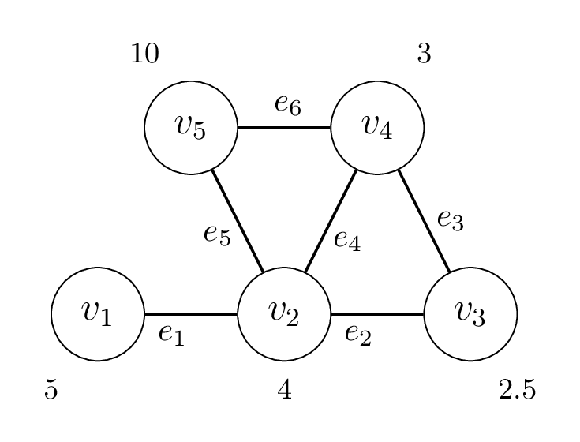

For weighted vertex cover, each edge $(v_i,v_j)$ contributes a constraint $x_i + x_j \ge 1$. Suppose constraints are written as $A[x_1\ x_2\ x_3\ x_4\ x_5]^T \ge b$, with row $i$ corresponding to edge $e_i$.

If row $i$ in matrix $A$ corresponds to the constraint created for edge $e_i$, what would be the correct values of row 5?

## Options
- [x] $0,1,0,0,1$
- [ ] $0,4,0,0,10$
- [ ] $1,1,0,0,0$
- [ ] $5,4,0,0,0$

> [!solution]
> Correct option: $0,1,0,0,1$
